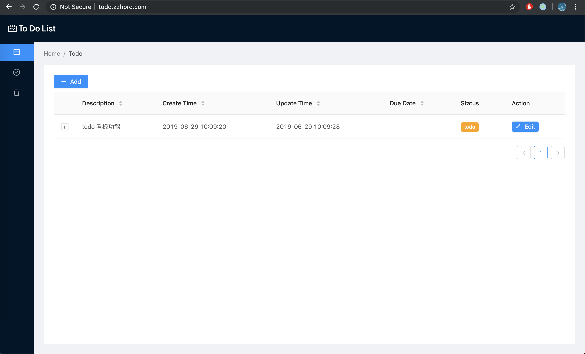

# Todo List

    <h3 align="center">todoList</h3>
    

        
        
        
        
    

    

        A Fancy Todo Task Management 
    

## 🚀 How to run

1. yarn add
2. yarn start
3. go to http://localhost:6075
4. other pages
   - online IDE: http://localhost:6076
   - dev server: http://localhost:6077

### For deployment

1. yarn build
2. yarn deploy (run in server)
3. use `serve` to serve static files

## Feature

### Menu

1. Todo
2. Completed
3. Deleted

### Improvement

- [x] status tag
- [ ] due date notification
- [ ] kanban

## Tech Stack

- rekit
  - react v16
  - redux
  - react router v4
- ant design
- dexie
- IndexedDB
- react-markdown
- react-ace
- moment

## Author

👤 **Zhihao Zhang**

- Github: [@zzh1991](https://github.com/zzh1991)

## Show your support

Please ⭐️ this repository if this project helped you!

## 📝 License

Copyright © 2019 [zzh1991](https://github.com/zzh1991). 
This project is [MIT](https://github.com/zzh1991/todo/blob/master/LICENSE) licensed.
